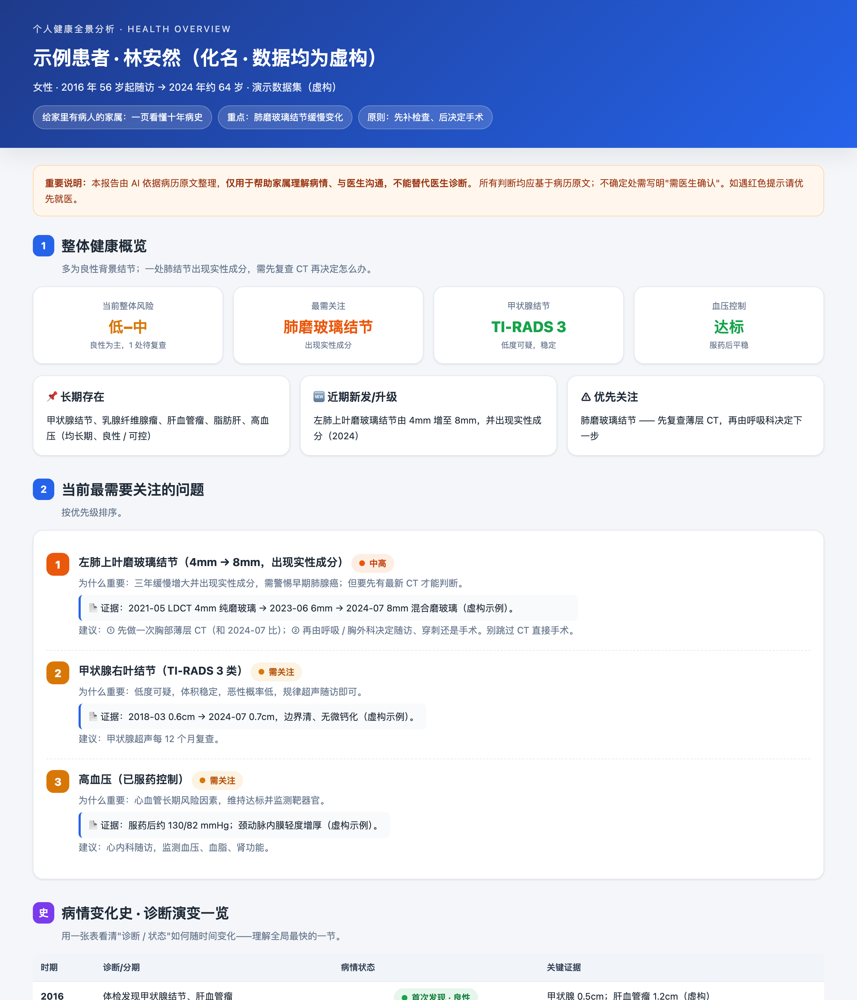
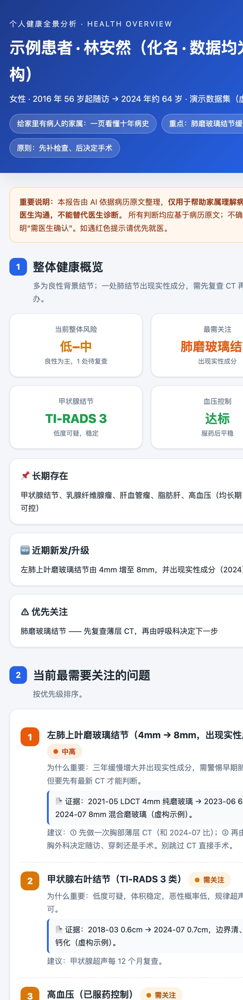
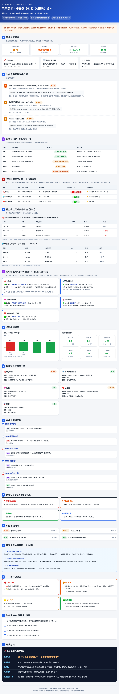

<div align="center">

# 🩺 病历全景报告 · Medical History Report

### 家里有人生病，一箱看不懂的检查单，变成一页家人都能看懂的健康地图。

*For families caring for someone at home — turn years of scattered medical records
into ONE clear, mobile-friendly health report: a disease-history timeline,
per-lesion size tracking, what-exam-is-missing gaps, and a plain checklist for the next hospital visit.*

<br>

[](LICENSE)


<br>



</div>

---

## 😣 这一幕，太多家庭都经历过

家里老人病了好几年，攒下**一整箱**化验单、CT 片、超声、出院小结、PET 报告……
每张你都看不太懂，更别说把十年连起来看：

> *"那个结节到底是大了还是没变？"*
> *"是越来越重，还是已经稳定了？"*
> *"他这次为啥又只抽了血？该做的检查到底是哪个？"*
> *"下次去医院，我该问医生什么？"*

医生没时间帮你把十年病历从头捋一遍。**这个工具帮你捋，而且捋得明明白白。**

## ✨ 它给你什么

把一个人多年的病历（体检 / 化验 / 超声 / CT / MRI / PET / 病理 / 出院诊断）读进来，
自动生成**一份自带样式、断网也能开、手机也好看的 HTML 报告**：

| | 模块 | 一句话价值 |
|---|---|---|
| 📍 | **30 秒看懂** | 一句话结论 + 红黄绿三栏（每件事只出现一次，不重复）|
| 📜 | **病情变化史** | 诊断怎么一步步演变，一张表看懂 |
| 📈 | **逐个看·病灶尺寸轨迹** | 每个结节**只和自己比**，标清**年-月 + 检查类型** |
| ⚠️ | **关键数据缺口** | 哪个部位**缺最新检查**、是没做还是没找到、**现在该补做啥** |
| 🔬 | **认准一种检查 + 多久查一次** | 为什么尺寸老对不上；正常体检/随访到底该做哪种 |
| 🩺 | **先检查、后手术** | 缺数据先补检查，手术放到拿到结果之后再定 |
| 💬 | **家属大白话版** | 不懂医学也能看明白 |
| ✅ | **问医生清单** | 直接打印带去医院 |

> 🔒 **铁律**：一切基于病历原文，**不编造**；不确定写"需医生确认"；严重信号标红。
> **它帮你理解病情、和医生沟通——但永远不替代医生。**

### 🌟 和别的"病历总结"最不一样的三点

1. **同部位才比、注明检查类型** —— 不会把"肺结节"和"淋巴结"混在一张表。每个数据点都写清是哪年哪月、用 CT 还是超声还是 PET，因为**不同设备测出来本就对不上**。
2. **告诉你"缺什么检查"** —— 明确指出哪个部位最近一次标准检查是什么时候、有没有复查，回答家属最常问的"是没找到，还是根本没做"。
3. **"先检查、后手术"** —— 不鼓励在没有最新影像时直接开刀；先补齐检查、再由医生决定。

<div align="center">
<table><tr>
<td align="center"><b>📱 手机视图</b><br></td>
<td align="center"><b>🖥️ 完整报告</b><br></td>
</tr></table>
<sub>以上预览均使用<b>完全虚构</b>的示例病人「林安然（化名）」——与任何真实病人无关。</sub>
</div>

---

## 🚀 30 秒上手

```bash
# 1) 结构化 JSON → 一页 HTML 报告（零依赖，开箱即用）
python3 scripts/build_report.py examples/sample_patient.json out.html

# 2) （可选）导出长图 + PDF，直接发微信给家人
python3 scripts/export_pdf.py out.html out      # → out-long.png  +  out.pdf
```

打开 `out.html` 就是上面那份报告。换成你自己的 `patient.json`，就是你家人的报告。

## 🤖 作为 Claude Skill 使用（推荐）

魔法在这里——你不用手填 JSON。把 skill 装进 Claude：

```bash
git clone https://github.com/SkylarWJY/medical-history-report \
  ~/.claude/skills/medical-history-report
```

然后直接对 Claude 说：**"帮我把这箱病历整理成一份健康报告。"**
Claude 会照着 [`SKILL.md`](SKILL.md) 的 5 步走：

```
清点资料 → 并行多智能体逐张读取/提取病灶尺寸 → 汇总结构化(含缺口/检查计划) → 生成 HTML → 导出长图/PDF
```

> 💡 资料量大也不怕：上百份扫描件时，skill 会**为每份就诊档案派一个提取智能体并行处理**——几小时的活儿压缩到几分钟。

## 📦 仓库结构

```
medical-history-report/
├─ SKILL.md                    # 给 Claude 的工作流指令（5 步法 + 同部位可比/先检查后手术原则）
├─ assets/schema.json          # 病灶/诊断/缺口/检查计划的结构化数据规范
├─ scripts/
│  ├─ build_report.py          # JSON → 手机自适应 HTML（零依赖，已测试）
│  └─ export_pdf.py            # HTML → 长图 PNG + PDF（Chrome + Pillow）
└─ examples/
   ├─ sample_patient.json      # 虚构示例数据
   └─ sample_report.html       # 生成好的样例报告
```

数据怎么填？看 [`assets/schema.json`](assets/schema.json)（每个模块都可选，你给什么它画什么）
和 [`examples/sample_patient.json`](examples/sample_patient.json) 的完整范例。

## 🔐 隐私优先

病历是最敏感的个人数据。本工具**默认本地处理、不上传、不部署公网**。
想在手机看？优先把单文件 HTML/PDF 发到手机离线打开；确需共享给异地家人时，
建议用**密码加密**方案并先确认。**任何演示 / 公开示例，一律使用虚构数据。**

## 📄 License

[MIT](LICENSE) · 用得上就拿去用，记得善待你的家人。❤️

<div align="center"><sub>Built with Claude · 如果它帮到了你或你的家人，欢迎点个 ⭐</sub></div>
