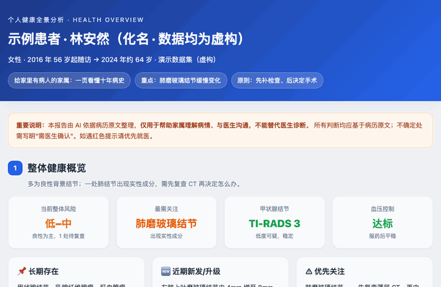
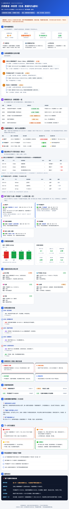

<div align="center">

# 🩺 病历全景报告 · Medical History Report

### 家里有人生病，或想长期管好自己的健康 —— 把一堆看不懂的检查报告，变成一份看得懂、追得住的健康报告。

*For caregivers AND self-trackers: turn messy medical records into one clear, longitudinal health report.*

<br>

**两类人都用得上 👇**

| | 谁 | 它给你什么 |
|---|---|---|
| 🏥 | **家里有病人** | 一位老人**十年杂乱的扫描件**（手写 / 旋转 / 中英混）→ **家属能看懂的报告** ＋ **按部位追踪肿瘤大小** ＋ **缺哪一项检查、该补做什么** |
| 💪 | **管理自己的健康** | 把历年体检 / 化验**连成趋势**，**自动标红一直异常或在变差的**，配一张**该复查日历**——异常早发现，而不是体检完把单子扔抽屉 |

> 市面上要么是给诊所的 EHR、要么是连医院端口拉**干净结构化数据**的聚合器、要么是给健康人**卖验血**的会员制 App——
> **几乎没有**专门做"一堆看不懂的旧报告 → 自己和家人都能看懂、还能长期追踪"的。这就是它存在的理由。

<br>

[](LICENSE)


<br>



<sub>↑ 真实生成效果（数据为<b>完全虚构</b>的示例病人「林安然（化名）」，与任何真实病人无关）</sub>

</div>

---

## ⚡ 怎么用：扔进去 → 出报告

这是一个 **Claude Skill**。装好之后，你**不用填任何表格**——

```
①  把报告丢给 Claude              ②  说一句话                 ③  拿到报告
   （病人的病历，或你自己的     →  "帮我整理成健康报告"  →   一份 HTML（可导长图/PDF）
    历年体检单都行）
```

Claude 会自动：**逐张读取扫描件 → 提取每个病灶的尺寸和日期 → 汇总 → 生成报告**。
资料上百份也不怕——它会派多个智能体并行读，几分钟搞定。

---

## 🎯 报告分两大块，一眼分清"病情"和"行动"

> 这正是家属最需要的：**先看懂他怎么了，再知道该做什么。**

### 📖 第一块：看懂病情（他"有什么"、怎么变的）

| 模块 | 给你什么 |
|---|---|
| 📍 **30 秒看懂** | 一句话结论 + 红黄绿三栏（变好 / 没变 / 变差，每件事只出现一次）|
| 📜 **病情变化史** | 诊断怎么一步步演变，一张表看懂 |
| 📈 **逐个看·尺寸轨迹** | 每个结节**只和自己比**，每个点标清**年-月 + 检查类型** |
| 🫀 **器官系统分类** | 按肺、甲状腺、心血管… 分门别类 |

### 🎯 第二块：知道怎么办（"做什么"）

| 模块 | 给你什么 |
|---|---|
| ⚠️ **关键数据缺口** | 哪个部位**缺最新检查**、是没做还是没找到、**现在该补做哪一项** |
| 🔬 **认准一种检查 + 多久查一次** | 为什么尺寸老对不上；正常随访/体检到底该做哪种检查 |
| 🩺 **先检查、后手术** | 缺数据先补检查，手术放到拿到结果之后再定 |
| 📅 **该复查日历** | 每个部位下次什么时候、做哪一项，到点提醒 |
| ✅ **问医生清单** | 直接打印带去医院 |

> 🔒 **铁律**：一切基于病历原文，**不编造**；不确定写"需医生确认"；严重信号标红。
> **它帮你理解病情、和医生沟通——但永远不替代医生。**

### 🆕 健康追踪模式 —— 不止给病人，也给"想管理健康的人"

把**多次体检/化验的关键指标连成一张趋势表**，自动**标红一直异常或在变差的**（如"总胆固醇一直偏高、缓慢上升"），再配一张**该复查日历**。
即使没生病，也能把血脂、血糖、肝肾、甲功、肿瘤标志物**逐年盯住**——异常早发现，而不是每年体检完把单子扔进抽屉。

---

## 🌟 和普通"病历总结"最不一样的三点

1. **同部位才比、注明检查类型** —— 不会把"肺结节"和"淋巴结"混在一张表。每个数字都写清是哪年哪月、用 CT 还是超声还是 PET，因为**不同设备测出来本就对不上**。
2. **告诉你"缺什么检查"** —— 明确指出哪个部位最近一次标准检查是什么时候、有没有复查，回答家属最常问的"是没找到，还是根本没做"。
3. **"先检查、后手术"** —— 不鼓励在没有最新影像时直接开刀；先补齐检查、再由医生决定。

---

## 🖼️ 完整报告长这样

<div align="center">

<br><sub>一整页，自带样式、断网也能开、手机也好看（示例为虚构数据）</sub>
</div>

---

## 🚀 也可以直接当命令行工具用

```bash
# 结构化 JSON → 一页 HTML 报告（零依赖，开箱即用）
python3 scripts/build_report.py examples/sample_patient.json out.html

# （可选）导出长图 + PDF，直接发微信给家人
python3 scripts/export_pdf.py out.html out      # → out-long.png  +  out.pdf
```

## 🤖 作为 Claude Skill 安装

```bash
git clone https://github.com/SkylarWJY/medical-history-report \
  ~/.claude/skills/medical-history-report
```

然后把病历丢给 Claude，说"帮我整理成健康报告"即可。Claude 会照着 [`SKILL.md`](SKILL.md) 的流程走。

## 📦 仓库结构

```
medical-history-report/
├─ SKILL.md                    # 给 Claude 的工作流（含"同部位才比 / 先检查后手术"原则）
├─ assets/schema.json          # 病灶 / 诊断 / 数据缺口 / 检查计划 的数据规范
├─ scripts/
│  ├─ build_report.py          # JSON → 手机自适应 HTML（零依赖，已测试）
│  └─ export_pdf.py            # HTML → 长图 PNG + PDF（Chrome + Pillow）
└─ examples/
   ├─ sample_patient.json      # 虚构示例数据
   └─ sample_report.html       # 生成好的样例报告
```

## 🔐 隐私优先

病历是最敏感的个人数据。本工具**默认本地处理、不上传、不部署公网**；
想在手机看就把单文件发到手机离线打开。**任何演示 / 公开示例，一律使用虚构数据。**

## 📄 License

[MIT](LICENSE) · 用得上就拿去用，记得善待你的家人。❤️

<div align="center"><sub>Built with Claude · 如果它帮到了你或你的家人，欢迎点个 ⭐</sub></div>
